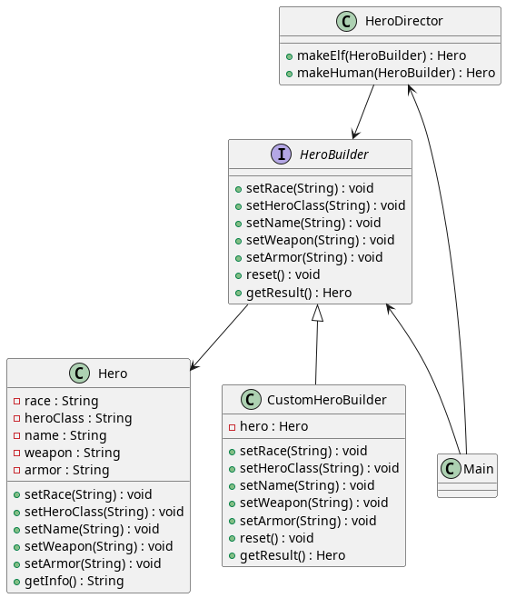
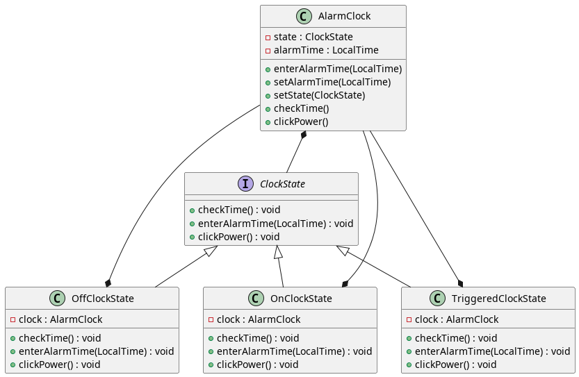

# COO - Séance 5 - Rémy HENDRICÉ

# Cas 1

## Problématique

Récupérer la description d'un projet gitlab depuis un appel HTTP vers l'API de GitLab en utilisant les classes URIBuilder et HttpURLConnection.
Identifier les collaborateurs du design pattern Builder.

## Résolution

Dans un premier temps, j'ai construit l'URL vers l'API GitLab grâce à l'URIBuilder qui, comme son nom l'indique, permet de construire des URI étape par étape.
Ceci se fait en spécifiant un scheme (le protocole à utiliser), un hôte et enfin le chemin vers la ressource souhaitée.
En appelant la méthode build(), on obtient alors un URI qui peut être converti en URL.

Cet objet URL permet de créer un HttpURLConnection. Ce dernier peut être considéré égalemet comme étant un builder étant donné, qu'après avoir défini la méthode HTTP, il est possible de construire un InputStream qui véhicule la réponse HTTP.

Dans ce cas-ci, il n'y a pas de Directeur impliqué.

## Références :

Design pattern: (https://refactoring.guru/design-patterns/builder)

Utilisation URIBuilder & HttpURLConnection : (https://www.digitalocean.com/community/tutorials/java-httpurlconnection-example-java-http-request-get-post)

## Diagramme de classes :

\newpage

# Cas 2

## Problématique

Concevoir des personnages pour un jeu vidéo de type RPG.

## Résolution

Après avoir résolu le cas précédent, mon choix s'est directement porté vers le Builder pour résoudre ce cas n°2.
En effet, celui-ci permet d'encapsuler un objet, comme un Hero, et de définir les attributs de cet objet de façon indépendante et flexible.

J'ai défini une interface HeroBuilder qui est implémentée par la classe CustomHeroBuilder. Cette séparation par interface nous laisse la possibilité de définir plusieurs builder concrets. 
Cela pourrait être utile si l'on souhaite appliquer différentes règles lors de la création du personnage (e.g.: un orc ne pourrait pas avoir la classe "prêtre", un elfe aurait de l'intelligence accrue, ...).

Dans ce cas-ci, j'ai ajouté un Directeur. Son rôle est d'ordonner la création d'objets Hero selon un schéma prédéfini en utilisant un HeroBuilder.

## Références :
Design pattern: https://refactoring.guru/design-patterns/builder

## Diagramme de classes :

\newpage

# Cas 3

## Problématique

Développer le code d'un réveil de manière à pouvoir déléguer l'implémentation des différents états.

## Résolution

Dans l'énoncé de ce cas, il y a 3 états clairement définis et chacun a son propre comportement. J'ai donc étudié et appliqué le design pattern "State" qui me semblait plus que pertinent.

Ce design pattern propose d'externaliser les différents comportements possibles d'un objet dans des états. L'objet possède un état qui est mis à jour en fonction du changement interne de l'objet. Ce changement d'état modifie l'implémentation des méthodes de l'objet comme s'il avait changé de classe. 
De plus, chaque état est indépendant des autres états, et leur développement peut être mené en parallèle.

Pour cette problématique, j'ai défini trois classes représentant les états "Alarme off", "Alarme on" et "Alarme sonne". 
Le changement d'état s'effectue par les classes états elle-même lorsqu'il y a besoin (e.g.: le bouton est appuyé pour éteindre l'alarme, l'heure de l'alarme a été atteint, ...).

### Références :
Design pattern: https://refactoring.guru/design-patterns/state

## Diagramme de classes : 

