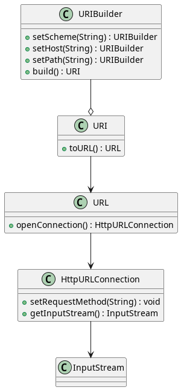

# Cas 1
## Design Pattern - Builder

Ref: https://refactoring.guru/design-patterns/builder
https://www.digitalocean.com/community/tutorials/java-httpurlconnection-example-java-http-request-get-post

### Diagramme de classes :

# Cas 2

## Design Pattern - Builder

### Diagramme de classes :

Ref: https://refactoring.guru/design-patterns/builder

# Cas 3

## Design Pattern - State

### Diagramme de classes : 

Ref: https://refactoring.guru/design-patterns/state